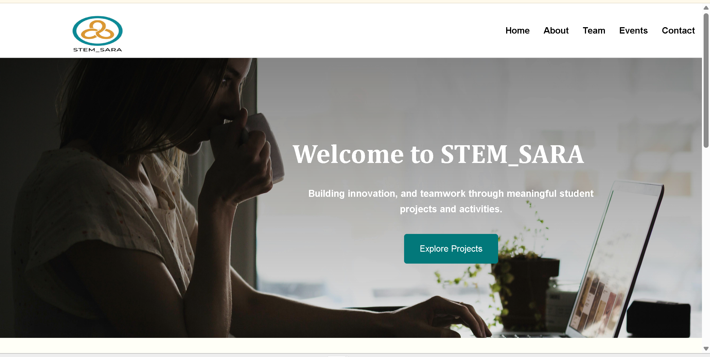

# STEM_SARA



STEM_SARA is a fictional STEM education club website developed as a prototype for a web development project. Inspired by a real student-led initiative, the project demonstrates the design and development of a modern, multi-page website using **HTML5** and **CSS3**.

## Features

- Multi-page website
- Responsive navigation bar
- Modern and clean user interface
- Image gallery
- Organized folder structure
- Built using only HTML and CSS

## Pages

- Home
- About
- Team
- Events
- Contact

> **Note:** The project also includes `project.html` and `gallery.html` as optional pages. They are currently commented out in the navigation and can be integrated into future versions if needed.

## Technologies Used

- HTML5
- CSS3

## Project Structure

```
STEM_SARA/
│
├── CSS/
│   └── style.css
│
├── Images/
│
├── index.html
├── about.html
├── projects.html
├── events.html
├── gallery.html
├── team.html
└── contact.html
```

## Getting Started

1. Clone the repository.

```bash
git clone https://github.com/your-username/STEM_SARA.git
```

2. Open `index.html` in your preferred web browser.

No installation or additional software is required.

## Author

**Fatima Salik**  
Computer Science Student  
Albukhary International University

---

*This project was created for educational purposes as part of a university web development course.*
